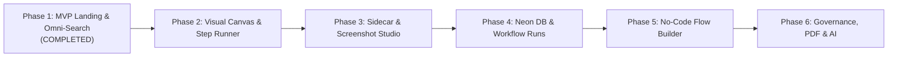

# Fanavari: Phased Implementation Roadmap & Execution Plan

## 1. Roadmap Architecture
To ensure continuous delivery of demonstrable value while building toward an enterprise-grade digital adoption and SOP platform, development is structured into **six focused, sequential phases**. Each phase delivers high-impact functionality with clear acceptance criteria.

---

## 2. Phase-by-Phase Execution Plan

### Phase 1: Foundation & Omni-Search Showcase (Status: ✅ COMPLETED)
- [x] Initialized Next.js 15 + TypeScript architecture with full RTL & Vazirmatn Persian typography.
- [x] Configured Light & Dark theme system with strict Light Mode default and zero flicker.
- [x] Implemented Google-style Omni-Search engine with deep facet scanning and relevance scoring.
- [x] Built contextual match highlighting with exact location badges (Step, Error, Field, System).
- [x] Created 8 comprehensive, realistic organizational workflows across HR, Finance, IT, Legal, and Support.
- [x] Built Interactive Flow Simulator and Process Detail Modal with Step Stepper, Error Matrix, and Scratchpad.
- [x] Configured Prisma 7 with zero-url schema and `prisma.config.ts`.

---

### Phase 2: Full-Screen Visual Canvas Flowchart & Synchronized Runner (Next Step)
*Objective: Deliver the true visual flowchart experience using `@xyflow/react` with synchronized step execution.*

- **Key Deliverables**:
  1. Dedicated process route: `/process/[slug]`.
  2. Integration of `@xyflow/react` (React Flow) with customized glassmorphic node types:
     - `ActionNode`: System URL, step title, menu path, and icon.
     - `DecisionNode`: Diamond/curved geometry with labeled branch edges (e.g., *"بله" / "خیر"*).
     - `WarningNode`: High-contrast alert styling for critical compliance steps.
     - `EndNode`: Terminal node with success checkmark.
  3. Interactive Canvas Controls:
     - Zoom (10% - 200%), Pan, Fit View, and Minimap.
     - Active path tracing: selecting a step highlights the preceding and following edges in radiant blue/cyan glow.
  4. Synchronized Guided Runner:
     - Split layout option: Canvas on the left, active step card on the right.
     - Advancing in the stepper automatically pans the canvas camera to center on the active node.
- **Estimated Timeline**: 3–4 days.

---

### Phase 3: Sidecar Mode & Screenshot Annotation Studio
*Objective: Maximize operator productivity during real-time work in external software.*

- **Key Deliverables**:
  1. **Dockable Sidecar Runner Mode**:
     - Compact 380px vertical sidebar that docks to the side of the screen.
     - Allows employees to operate target government/internal portals (e.g., *Moadian*, *HRMS*, *Sepidar*) side-by-side with the SOP guide.
  2. **Screenshot Hotspot Viewer & Privacy Blurring**:
     - Displays actual system screenshots with numbered glowing pinpoints (1, 2, 3) pointing to exact input fields and buttons.
     - Canvas blur shader tool for obscuring confidential national IDs, phone numbers, and credentials before publishing.
  3. **Enhanced Scratchpad Persistence**:
     - Auto-save across page refreshes with one-click clear and copy-all utilities.
- **Estimated Timeline**: 3–4 days.

---

### Phase 4: Neon Postgres Integration & Actionable Workflow Runs
*Objective: Transform passive documentation into tracked, compliant execution instances.*

- **Key Deliverables**:
  1. **Neon Serverless Postgres Connection**:
     - Configure connection pooler URL in `.env` and `prisma.config.ts`.
     - Execute initial Prisma 7 migration (`prisma migrate dev`).
     - Seed database with standard organizational SOPs.
  2. **Tracked Workflow Runs (Execution Engine)**:
     - Users can click *"شروع اجرای فرایند"* to initiate an official run instance.
     - Check off steps in real-time, recording timestamps and completion status in Neon.
     - Session recovery: resume partially completed workflows from any device.
  3. **Audit Trail & History**:
     - History dashboard displaying completed runs, operator names, and total duration.
- **Estimated Timeline**: 4–5 days.

---

### Phase 5: No-Code Flow Builder Studio (Admin Mode)
*Objective: Enable non-technical department leads to create and modify SOPs visually.*

- **Key Deliverables**:
  1. Visual Drag-and-Drop Node Canvas:
     - Add, duplicate, delete, and rearrange steps effortlessly.
     - Connect nodes with condition-labeled edges directly on the canvas.
  2. Rich Step Inspector:
     - Markdown instruction editor with live preview.
     - Copyable fields manager (add label and sample value pairs).
     - Per-step Error & Troubleshooting matrix authoring (error code, cause, solution, escalation).
  3. Screenshot Uploader with Crop & Blur:
     - Upload UI screenshots, add hotspot pins, and blur sensitive regions directly in the browser.
- **Estimated Timeline**: 5–6 days.

---

### Phase 6: Enterprise Governance, ISO PDF Export & AI Assistant
*Objective: Institutionalize SOP management with quality assurance, compliance, and AI.*

- **Key Deliverables**:
  1. **"Report UI Change" Community Feedback**:
     - Employees can flag an outdated step with a single click and attach a new screenshot.
     - Admin moderation inbox to approve or reject suggested updates.
  2. **Executive & ISO Print-Ready PDF Generator**:
     - One-click export producing clean, branded corporate PDFs containing document metadata, flowchart diagram, step manuals, and error directories.
  3. **AI Flow Assistant**:
     - Natural language processor: paste unstructured circulars, policies, or meeting notes to automatically generate a draft flowchart with steps, branches, and error predictions.
  4. **Production Deployment to Vercel**:
     - Edge caching, production environment variables, and CDN asset optimization.
- **Estimated Timeline**: 4–5 days.

---

## 3. Prioritized Task Backlog for Next Sprints

| Item # | Task Description | Phase | Complexity | Status |
| :---: | :--- | :---: | :---: | :---: |
| **01** | Landing page with Omni-Search & Light/Dark themes | Phase 1 | Medium | ✅ Complete |
| **02** | Google-style deep relevance scoring & snippets | Phase 1 | High | ✅ Complete |
| **03** | Prisma 7 schema & `prisma.config.ts` setup | Phase 1 | Low | ✅ Complete |
| **04** | Install `@xyflow/react` and design custom glass nodes | Phase 2 | Medium | ⏳ Next Up |
| **05** | Build dedicated `/process/[slug]` page with dual canvas/stepper | Phase 2 | High | ⏳ Next Up |
| **06** | Implement camera auto-panning on active step selection | Phase 2 | Medium | Pending |
| **07** | Build dockable Sidecar mode for side-by-side operation | Phase 3 | Medium | Pending |
| **08** | Implement image hotspot pins and privacy blur canvas tool | Phase 3 | High | Pending |
| **09** | Connect Neon Postgres and run Prisma migrations | Phase 4 | Medium | Pending |
| **10** | Implement persistent Workflow Run instances & checklist logs | Phase 4 | High | Pending |
| **11** | Build visual No-Code Flow Builder studio | Phase 5 | High | Pending |
| **12** | Implement ISO corporate PDF export and UI change reporting | Phase 6 | Medium | Pending |
