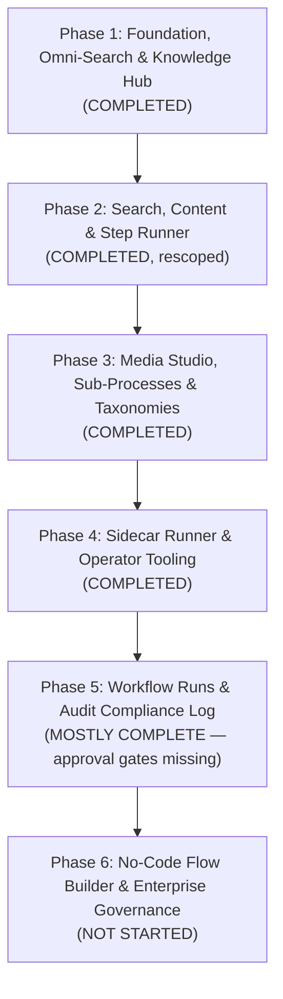

# Fanavari: Phased Implementation Roadmap & Execution Plan

## 1. Roadmap Architecture
To ensure continuous delivery of demonstrable value while building toward an enterprise-grade digital adoption and SOP platform, development is structured into **focused, prioritized phases**. This roadmap integrates organizational directives, platform specifications, and direct feedback from the official circular (*"آپدیت مورد نیاز در فناوری"*).

> **Rescoping note (Oct 2026):** The macro flowchart canvas, the Process Runner
> progress/celebration UI, and estimated-time display were deliberately removed
> from the product at the owner's request. The process page is now a single
> step-by-step walkthrough. Items below reflect that decision.

---

## 2. Phase-by-Phase Execution Plan

### Phase 1: Foundation, Omni-Search & Knowledge Hub (Status: ✅ COMPLETED)
- [x] Initialized Next.js 15+ & TypeScript architecture with full RTL & Vazirmatn Persian typography.
- [x] Light & Dark theme system with strict Light Mode default and zero flicker.
- [x] Google-style Omni-Search engine scanning process titles, steps, error codes, and systems.
- [x] Neon Postgres connection with Prisma 7 zero-url configuration and migrations.
- [x] Official Announcements & Directives Knowledge Base (`/information`, `/information/[slug]`).
- [x] TipTap rich-text WYSIWYG editor for policy and circular creation.
- [x] Dedicated high-contrast printable process view (`/process/[slug]/print`).
- [x] Interactive Tag/Box Menu Path Editor (`MenuPathEditor`) and prominent breadcrumbs (`MenuPathDisplay`).

---

### Phase 2: Search, Content & Step Runner (Status: ✅ COMPLETED, rescoped)
*Objective: high-quality linear walkthrough with unified cross-entity search.*

#### Sprint 2A: Search & Content (Priority: P0 — Done)
- [x] **2A.1. Omni-Search Expansion for Announcements & Circulars**:
  - `InformationPost` records indexed alongside processes with dedicated badges and deep-links.
- [x] **2A.2. Real-Data Quick Suggestions & Trending Queries**:
  - Real-time aggregates from the database (systems, keywords, categories).
- [x] **2A.3. Step Pro-Tips & Callouts (`نکات و هشدارها`)**:
  - Structured callout badges on steps (Tip `نکته`, Warning `هشدار`, Important `توجه`).
- [x] **2A.4. In-Text Cross-Linking**:
  - Links to other processes (`/process/[slug]`), systems, and circulars inside step markdown.

#### Sprint 2B: Step Walkthrough Only (Priority: P1 — Done, rescoped)
- [x] **2B.1. Step Runner Walkthrough**: linear guided execution (menu breadcrumbs,
  screenshots, hotspots, copyable fields, error guides, checkboxes, prev/next).
- [x] ~~**Distinct Flowchart Node Geometries (`@xyflow/react`)**~~ — **REMOVED (Oct 2026)**:
  - The macro canvas (`flowchart-canvas.tsx`, `flowchart-nodes.tsx`) was deleted
    by owner decision. The process page no longer has a canvas view.
- [ ] **2B.2. Process Timeline View Mode (`نمای تایم‌لاین فرایند`)**: **NOT BUILT** —
  never implemented (the `/timeline` route is the admin calendar, a different feature).
- [x] **2B.3. Step Progression**: per-step completion checkboxes persisted to
  localStorage + workflow-run logging. The runner **progress bar card and the
  completion celebration card were REMOVED (Oct 2026)** as visual clutter.
- [x] **Estimated-time display REMOVED (Oct 2026)** from all views and the
  dashboard editor (DB column retained, unused by UI).

---

### Phase 3: Media Studio, Sub-Processes & Taxonomies (Status: ✅ COMPLETED)
*Objective: rich step instructions with inline media and hierarchical procedures.*

- [x] **3.1. Inline Images & Lightbox**:
  - Inline micro-images inside step text; full-screen lightbox with zoom for
    screenshots and hotspot pins (`ImageHotspotViewer`).
- [x] **3.2. Sub-Processes Architecture (`زیر-فرایندها`)**:
  - Steps link to child processes with drill-down drawer and breadcrumb return.
- [x] **3.3. Thematic Category & Tag Management (`مدیریت دسته‌بندی موضوعی`)**:
  - Admin UI (`/dashboard/scopes-categories`) to create/edit scopes and categories.

---

### Phase 4: Sidecar Runner & Operator Productivity (Status: ✅ COMPLETED)
*Objective: live operation inside external software.*

- [x] **4.1. Dockable Sidecar Runner Mode**:
  - Compact sidebar + dedicated `/process/[slug]/sidecar` page for dual-window
    operation with ERP/HRMS portals.
- [x] **4.2. Screenshot Hotspot Viewer & Privacy Tools**:
  - Numbered hotspot pins on screenshots; canvas blur/pixelation for national IDs,
    phone numbers, and credentials (`ScreenshotEditorModal`).
- [x] **4.3. Scratchpad Synchronization**:
  - Auto-saved session scratchpad persisted across browser reloads.

---

### Phase 5: Workflow Runs & Audit Compliance Log (Status: ✅ MOSTLY COMPLETE)
*Objective: tracked, compliant execution instances.*

- [x] **5.1. Tracked Workflow Run Instances**:
  - Official runs with operator name, timestamps, checklist progress, and step logs
    (`/dashboard/runs`, runs tab, quick-start/completion modals).
- [ ] **5.2. Supervisor Approval Gates**: **MISSING** — data fields exist
  (`supervisorApprovalStatus`, step sign-off flags) but no UX blocks a step
  pending supervisor approval.
- [x] **5.3. Audit Trail Reporting**:
  - Compliance audit sheet/certificate viewer modal per run.

---

### Phase 6: No-Code Flow Builder & Enterprise Governance (Status: ❌ NOT STARTED)
*Objective: visual authoring with version control.*

- [ ] **6.1. Visual Drag-and-Drop Canvas Builder**: not started (form-based
  `ProcessEditorModal` is the only authoring UI, plus the Chrome extension).
- [ ] **6.2. Executive ISO-Compliant PDF Export**: not started — only the
  browser-print view (`/process/[slug]/print`) exists.
- [ ] **6.3. AI Flow Assistant**: not started.

### Phase 7 (unplanned): Authoring Chrome Extension (Status: ⏳ M1 DONE)
*Added Oct 2026, outside the original roadmap.*
- [x] **M1 — Interaction recorder**: MV3 side panel, per-site/all-sites optional
  access, click-text + input-label capture (labels-only default, values on
  confirm, passwords never), browser-login token auth (`User.extensionToken`),
  `/extension-auth` single-account handoff, `steps/[stepId]/events` endpoint
  (clicks → menu-path boxes, inputs → instruction drafts).
- [ ] **M2 — Screenshot attach** (`captureVisibleTab` → upload → step image).
- [ ] **M3 — Polish** (label heuristics, full-page stitch — only if authors ask).

### Phase 8 (unplanned): Community Feedback (Status: ❌ NOT STARTED)
- [ ] **8.1. "Report UI Change"**: employees cannot flag outdated steps — no code exists.
- [ ] **8.2. Suggest-an-edit workflow**: no code exists.

---

## 3. Prioritized Master Task Backlog

| Item # | Task Description | Source / Phase | Priority | Complexity | Status |
| :---: | :--- | :---: | :---: | :---: | :---: |
| **01** | Landing page with Omni-Search & Light/Dark themes | Phase 1 | P0 | Medium | ✅ Complete |
| **02** | Neon Postgres & Prisma 7 zero-url setup | Phase 1 | P0 | Low | ✅ Complete |
| **03** | Announcements & Circulars Knowledge Base (`/information`) | Phase 1 | P0 | Medium | ✅ Complete |
| **04** | TipTap rich-text WYSIWYG editor | Phase 1 | P0 | Medium | ✅ Complete |
| **05** | High-contrast dedicated printable process view | Phase 1 | P0 | Low | ✅ Complete |
| **06** | Interactive Menu Path Box Editor & Breadcrumbs | Circular / Phase 1 | P0 | Medium | ✅ Complete |
| **07** | **Include Announcements in Omni-Search** | Circular Req #5 | **P0** | Low | ✅ Complete |
| **08** | **Real-Data Quick Suggestions & Popular Searches** | Circular Req #4 | **P0** | Low | ✅ Complete |
| **09** | **Step Notes & Callout Boxes (`نکات و هشدارها`)** | Circular Req | **P0** | Low | ✅ Complete |
| **10** | **In-Text Cross-Linking to other processes/systems** | Circular Req #8 | **P1** | Medium | ✅ Complete |
| **11** | **Distinct Node Types on Flowchart (Decision / End / Action)** | Circular Req / Phase 2 | **—** | Medium | 🗑️ Removed (Oct 2026, canvas deleted) |
| **12** | Annual Administrative Timeline Calendar (`/timeline`) | Phase 1 / Foundation | **P0** | High | ✅ Active |
| **13** | **Hierarchical Sub-Processes Architecture (`زیر-فرایندها`)** | Circular Req #1 | **P1** | High | ✅ Complete |
| **14** | **Inline Single-Line Images & Screenshot Lightbox** | Circular Req #3 & #9 | **P2** | Medium | ✅ Complete |
| **15** | **Thematic Category Management** | Circular Req #7 | **P2** | Medium | ✅ Complete |
| **16** | Dockable Sidecar runner mode | Phase 4 | P2 | Medium | ✅ Complete |
| **18** | Screenshot Hotspot pins & privacy blur | Phase 4 | P2 | High | ✅ Complete |
| **19** | Persistent Workflow Run instances & logs | Phase 5 | P3 | High | ✅ Complete (gates missing) |
| **20** | Visual No-Code Flow Builder studio | Phase 6 | P3 | High | Pending |
| **21** | ISO corporate PDF export | Phase 6 | P3 | Medium | Pending |
| **22** | Supervisor approval gates UX | Phase 5 | P2 | Medium | Pending (fields only) |
| **23** | Report UI Change / suggest-an-edit | Phase 8 | P2 | Medium | Pending (no code) |
| **24** | Process timeline view mode (process page) | Phase 2 | P3 | Medium | Pending (never built) |
| **25** | Authoring Chrome extension M1 (recorder + token auth) | Phase 7 | P1 | High | ✅ Complete |
| **26** | Extension M2 (screenshot attach) | Phase 7 | P2 | Medium | Pending |
| **27** | Dashboard process-table pagination | Maintenance | P3 | Low | ✅ Complete |
