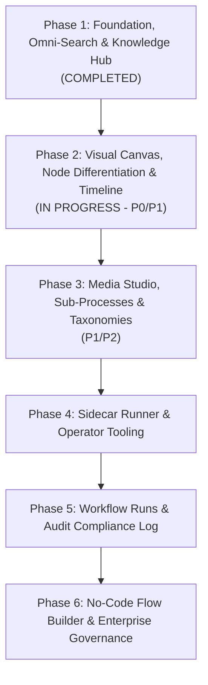

# Fanavari: Phased Implementation Roadmap & Execution Plan

## 1. Roadmap Architecture
To ensure continuous delivery of demonstrable value while building toward an enterprise-grade digital adoption and SOP platform, development is structured into **focused, prioritized phases**. This roadmap integrates organizational directives, platform specifications, and direct feedback from the official circular (*"آپدیت مورد نیاز در فناوری"*).

---

## 2. Phase-by-Phase Execution Plan

### Phase 1: Foundation, Omni-Search & Knowledge Hub (Status: ✅ COMPLETED)
- [x] Initialized Next.js 15+ & TypeScript architecture with full RTL & Vazirmatn Persian typography.
- [x] Light & Dark theme system with strict Light Mode default and zero flicker.
- [x] Google-style Omni-Search engine scanning process titles, steps, error codes, and systems.
- [x] Neon Postgres connection with Prisma 7 zero-url configuration and migrations.
- [x] Official Announcements & Directives Knowledge Base (`/information`, `/information/[slug]`).
- [x] TipTap rich-text WYSIWYG editor for policy and circular creation.
- [x] Dedicated high-contrast printable process view (`/process/[slug]/print`).
- [x] Interactive Tag/Box Menu Path Editor (`MenuPathEditor`) and prominent breadcrumbs (`MenuPathDisplay`).

---

### Phase 2: Visual Canvas, Node Differentiation & Timeline (Status: ⏳ NEXT UP / IN PROGRESS)
*Objective: Deliver high-fidelity visual flowcharting with BPMN-standard node distinction, timeline sequencing, and unified cross-entity search.*

#### Sprint 2A: Search & Content Quick Wins (Priority: P0 — Immediate)
- [ ] **2A.1. Omni-Search Expansion for Announcements & Circulars**:
  - Index `InformationPost` records alongside processes in the main search bar.
  - Return dedicated badges (`بخشنامه`, `دستورالعمل`, `اطلاعیه`) with direct deep-links.
- [ ] **2A.2. Real-Data Quick Suggestions & Trending Queries**:
  - Replace static suggestion chips with real-time aggregates from the database (active systems, most searched keywords, popular process categories).
- [ ] **2A.3. Step Pro-Tips & Callouts (`نکات و هشدارها`)**:
  - Structured callout badges on steps (Tip `نکته`, Warning `هشدار`, Important `توجه`).
- [ ] **2A.4. In-Text Cross-Linking**:
  - Support linking directly to other processes (`/process/[slug]`), systems, or circulars inside step markdown instructions.

#### Sprint 2B: Visual Flowchart & Timeline Overhaul (Priority: P1 — High)
- [ ] **2B.1. Distinct Flowchart Node Geometries (`@xyflow/react`)**:
  - **Action Node**: Standard rectangular card with menu breadcrumb, system badge, and icon.
  - **Decision Node**: Amber diamond geometry with conditional exit branches (*"بله" / "خیر"* or labeled logic gates).
  - **Warning / Checkpoint Node**: Rose-bordered alert node for critical compliance steps.
  - **End / Terminal Node**: Rounded double-ring emerald pill with completion checkmark.
- [ ] **2B.2. Process Timeline View Mode (`نمای تایم‌لاین فرایند`)**:
  - Multi-view switcher on `/process/[slug]` (Flowchart Canvas / Step Stepper / **Timeline**).
  - Chronological milestone tracker with step order, estimated durations, and completion markers.
- [ ] **2B.3. Interactive Step Simulator Polish**:
  - Interactive modal simulator with responsive step jumping, condition choice handling, and keyboard shortcuts.

---

### Phase 3: Media Studio, Sub-Processes & Taxonomies (Priority: P1/P2)
*Objective: Enrich step instructions with inline media and support hierarchical multi-level procedures.*

- [ ] **3.1. Inline Single-Line Images & Lightbox**:
  - Support inline micro-images (e.g., UI button icons, badges) inside step text lines.
  - Full-screen lightbox zoom for complex ERP and administrative portal screenshots.
- [ ] **3.2. Sub-Processes Architecture (`زیر-فرایندها`)**:
  - Ability for a process step to link to or embed a child sub-process.
  - Nested sub-flow badge with one-click drill-down and breadcrumb return navigation.
- [ ] **3.3. Thematic Category & Tag Management (`مدیریت دسته‌بندی موضوعی`)**:
  - Admin/Manager UI to dynamically create, edit, and organize process categories and organizational tags.

---

### Phase 4: Sidecar Runner & Operator Productivity (Priority: P2)
*Objective: Maximize employee productivity during live operation inside external software.*

- [ ] **4.1. Dockable Sidecar Runner Mode**:
  - Compact 380px vertical sidebar that docks to the side of the screen for dual-window operation with ERP/HRMS portals.
- [ ] **4.2. Screenshot Hotspot Viewer & Privacy Blurring**:
  - Numbered pins (1, 2, 3) pointing to exact input fields.
  - Canvas blur shader tool for redacting national IDs, phone numbers, and credentials.
- [ ] **4.3. Scratchpad Synchronization**:
  - Auto-saved session scratchpad synchronized across browser reloads.

---

### Phase 5: Workflow Runs & Audit Compliance Log (Priority: P3)
*Objective: Transform passive documentation into tracked, compliant execution instances.*

- [ ] **5.1. Tracked Workflow Run Instances**:
  - Launch an official execution run with operator name, start timestamp, and checklist progress.
- [ ] **5.2. Supervisor Approval Gates**:
  - High-risk compliance steps requiring manager approval before proceeding.
- [ ] **5.3. Audit Trail Reporting**:
  - Exportable compliance logs fulfilling ISO 9001 quality management requirements.

---

### Phase 6: No-Code Flow Builder & Enterprise Governance (Priority: P3)
*Objective: Empower department leads to author SOPs visually with version control and AI.*

- [ ] **6.1. Visual Drag-and-Drop Canvas Builder**:
  - Add, reorder, connect, and branch nodes visually.
- [ ] **6.2. Executive ISO-Compliant PDF Export**:
  - Branded executive PDF export with headers, flowchart diagrams, step manuals, and error matrices.
- [ ] **6.3. AI Flow Assistant**:
  - Paste raw circular text to automatically generate draft flowchart steps, branches, and error predictions.

---

## 3. Prioritized Master Task Backlog

| Item # | Task Description | Source / Phase | Priority | Complexity | Status |
| :---: | :--- | :---: | :---: | :---: | :---: |
| **01** | Landing page with Omni-Search & Light/Dark themes | Phase 1 | P0 | Medium | ✅ Complete |
| **02** | Neon Postgres & Prisma 7 zero-url setup | Phase 1 | P0 | Low | ✅ Complete |
| **03** | Announcements & Circulars Knowledge Base (`/information`) | Phase 1 | P0 | Medium | ✅ Complete |
| **04** | TipTap rich-text WYSIWYG editor | Phase 1 | P0 | Medium | ✅ Complete |
| **05** | High-contrast dedicated printable process view | Phase 1 | P0 | Low | ✅ Complete |
| **06** | Interactive Menu Path Box Editor & Breadcrumbs | Circular / Phase 1 | P0 | Medium | ✅ Complete |
| **07** | **Include Announcements in Omni-Search** | Circular Req #5 | **P0** | Low | ✅ Complete |
| **08** | **Real-Data Quick Suggestions & Popular Searches** | Circular Req #4 | **P0** | Low | ✅ Complete |
| **09** | **Step Notes & Callout Boxes (`نکات و هشدارها`)** | Circular Req | **P0** | Low | ✅ Complete |
| **10** | **In-Text Cross-Linking to other processes/systems** | Circular Req #8 | **P1** | Medium | ✅ Complete |
| **11** | **Distinct Node Types on Flowchart (Decision / End / Action)** | Circular Req / Phase 2 | **P1** | Medium | ✅ Complete |
| **12** | Annual Administrative Timeline Calendar (`/timeline`) | Phase 1 / Foundation | **P0** | High | ✅ Active |
| **13** | **Hierarchical Sub-Processes Architecture (`زیر-فرایندها`)** | Circular Req #1 | **P1** | High | ✅ Complete |
| **14** | **Inline Single-Line Images & Screenshot Lightbox** | Circular Req #3 & #9 | **P2** | Medium | Pending |
| **15** | **Thematic Category Management** | Circular Req #7 | **P2** | Medium | Pending |
| **16** | Dockable Sidecar runner mode | Phase 4 | P2 | Medium | ✅ Complete |
| **18** | Screenshot Hotspot pins & privacy blur | Phase 4 | P2 | High | Pending |
| **19** | Persistent Workflow Run instances & logs | Phase 5 | P3 | High | Pending |
| **20** | Visual No-Code Flow Builder studio | Phase 6 | P3 | High | Pending |
| **21** | ISO corporate PDF export | Phase 6 | P3 | Medium | Pending |
